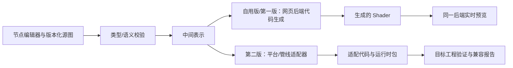

# 技术设计草案

更新：2026-09-30。本文定义系统边界和不变量，**没有选定编程语言、前端框架、数据库或部署平台**。

## 核心原则

**版本化节点图是唯一正式源文件，平台中的 Shader 均由节点工具生成。** 自用版先从图生成当前网页后端的 Shader，并用生成结果驱动实时预览，供项目方制作真实效果；对外第一版打磨这一创作内核；第二版从同一图生成各平台/渲染管线的适配代码与运行时包。图必须能重新打开、校验、构建和派生。公开作品不应只保存截图或生成代码。

图格式的统一只在 FXWeave 内成立；它不等于 GLSL、WGSL、HLSL 或某引擎原生图格式之间天然等价。第一版只须为已选定的网页后端明确能力集；第二版的每个目标由**平台/引擎版本 × 渲染管线 × 图类型 × 后端**界定。编译器应返回 `supported`、`partial` 或 `blocked`，并给出具体原因。

## 模块边界



- **自用版资产/图模型**：源图、带类型的端口与节点、参数、输入素材、预览场景、图版本、稳定 ID 与确定性序列化。
- **自用版网页编译与预览**：图校验、网页后端代码生成、Shader 编译、参数/素材绑定、实时渲染与定位到节点的错误；预览必须使用刚生成的 Shader，不能维护一套独立的“看起来相似”的解释器。先满足项目方实际创作，第一版再补面向外部用户的健壮性。
- **第二版目标适配**：从共同的图语义/中间表示生成每个平台及渲染管线的代码、资源绑定、材质或滤镜挂载方式与安装包。
- **第二版验证设施**：目标项目编译、示例渲染、参数响应、截图/指标比较，以及目标版本与管线记录。
- **后续应用层**：作品目录、发布、搜索、分享、API/MCP 和团队工作流，按真实需求接入同一源图服务。

## 源图建议字段

此结构是概念模型，不是已定 JSON Schema：

```json
{
  "schemaVersion": "...",
  "graphKind": "<selected-effect-kind>",
  "nodes": [{ "id": "...", "type": "...", "definitionVersion": "...", "values": {} }],
  "edges": [{ "fromNode": "...", "fromPort": "...", "toNode": "...", "toPort": "..." }],
  "parameters": [{ "id": "...", "type": "...", "default": "...", "range": "..." }],
  "inputs": [{ "id": "...", "semantic": "source-texture", "required": true }],
  "previewScenes": [{ "id": "...", "assetRefs": [], "time": 0 }]
}
```

正式 Schema 还须规定坐标系、UV/像素单位、颜色空间、透明表示、纹理采样方式、精度、时间语义、随机数种子和版本迁移规则。第一版需让这些语义在网页预览与生成结果之间一致；第二版才验证它们如何跨目标映射。

通用数学、颜色、纹理采样等节点可以共享；不同图类型使用不同根节点及可用输入。自用版先实现足以让项目方从空图制作数个真实效果的节点，不从所有 Shader 语言功能反推庞大的节点清单。保存/重开同一图应生成等价结果。

## 第一版网页后端候选：2D Web 对象/容器 Filter

这是研究建议，并非已确定技术选型。PixiJS 8 的 Filter 可挂到 Sprite 或 Container，支持自定义 Shader；第一版若选它，应固定 WebGL 后端和具体 PixiJS 版本，用节点工具生成 Filter Shader，并让预览运行该生成结果。Filter 处理已绘制内容；它不等于替换 Sprite 绘制材质。全屏后效和真正的 Sprite 材质需要新的图类型与挂载方式。[PixiJS Filters](https://pixijs.com/8.x/guides/components/filters)

第一版至少要能查看/保存节点源图、生成的网页 Shader、参数与素材输入说明，并证明重开图后结果一致。第二版的目标导出包应包含：适配后的 Shader、运行时封装/参数接口、所需纹理与依赖清单、版本及管线信息、最小安装示例、许可证、构建诊断，以及可回到 FXWeave 编辑的源图或引用。公开分享页面始终保留源图。

## 第二版：目标适配器与验证

每个适配器要声明：平台/引擎版本、渲染管线及后端、可用图类型、节点/输入支持、生成文件、运行时注入方法和测试矩阵。构建流程至少完成语义检查、目标编译检查、最小示例运行、关键参数响应检查。不同管线即使使用同一引擎，也可能需要不同代码与绑定方案；是否支持应逐管线声明。后续可加入参考截图和多设备性能测量。

兼容性是**源图版本 × 平台/引擎版本 × 渲染管线 × 后端 × 配置**的关系。“已验证”必须记录这些条件和验证日期。对不支持的节点、未满足的输入和预览差异给出具体提示，不能把「代码生成成功」等同于「游戏可用」。

## 源图演进与逃生口

图 Schema、节点定义和导出器分别版本化。已发布作品固定其源图版本；编辑旧作品时生成迁移草稿并显示差异。提供稳定节点 ID 便于 fork、比较和 AI 结构化编辑。

第一版不引入绕开节点工具直接提交 Shader 的创作路径。高级用户将来若需要自定义代码节点，它仍须是图内可打开、可校验的节点定义；同时要限制运行环境与资源预算，明确标注支持目标，并允许作品成为“目标专用”。

## AI 与 MCP

AI/MCP 建立在稳定的第一版图模型与编译接口之上，不能替代节点编辑器主流程。后续可把与 UI 共用的类型化操作映射为 MCP 工具，建议顺序：

1. `search_effects` / `get_effect`：按用途、类型、目标、许可检索，读取源图与依赖。
2. `fork_effect` / `set_parameters`：在草稿中派生和调整参数，返回精确错误。
3. `render_preview`：指定素材、时间、尺寸和背景，返回图像与诊断。
4. `validate_target` / `export_package`：在具体目标上构建、验证和交付。
5. `edit_graph`：图 Schema 与冲突处理稳定后，开放节点级补丁操作。

MCP 是接口，不负责解决图语义或引擎兼容。代理修改必须有可检查的预览、验证结果和资源消耗限制。[MCP Tools 规范](https://modelcontextprotocol.io/specification/2025-11-25/server/tools)

## 运行与内容边界

初期仅自制作品降低了外部代码、版权与审核复杂度。开放投稿后，预览/编译服务需要限制 CPU/GPU 时间、内存、纹理尺寸、循环和资源访问；作品素材与代码授权分别管理。发布者不能通过生成代码绕过源图与目标校验。
