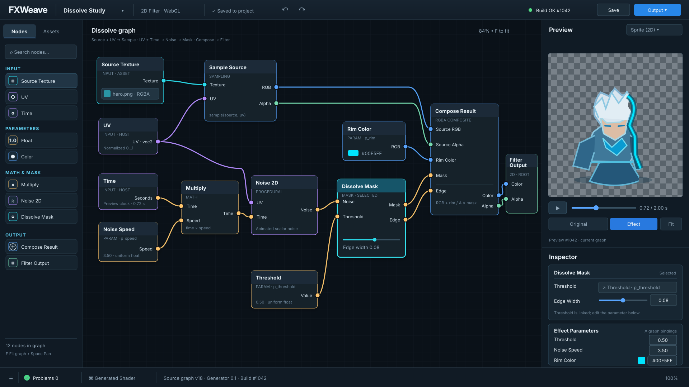

# FXWeave 自用版界面原画



当前主图是 **1920 × 1080 的确定性开发评审稿**：[PNG 预览](./visuals/fxweave-v0-editor-review.png) · [自包含 SVG 源稿](./visuals/fxweave-v0-editor-review.svg) · [生成脚本](./visuals/generate-v0-review.mjs)。脚本由同一份节点/端口数据生成节点与线条，生成时检查端口存在、类型相同、方向从左向右、每个输入至多一条线。因此图内连接可直接作为本例的界面与图语义评审依据。

布局对应[自用版功能与交互设计](./07-self-use-product-spec.md)：节点画布与预览同时可见，左侧节点/素材，右侧预览/属性，底部收起诊断与生成代码。图中 `2D Filter · WebGL` 是**本次评审的固定示例目标**，不代表规格中待定的首发宿主和渲染后端已经最终拍板。预览素材是用 SVG 绘制的 2D 测试角色，不代表项目的正式画风。

## 图内连接契约

| 输出端口 | 输入端口 | 类型 |
| --- | --- | --- |
| Source Texture.Texture | Sample Source.Texture | texture |
| UV.UV | Sample Source.UV | vec2 |
| UV.UV | Noise 2D.UV | vec2 |
| Time.Seconds | Multiply.Time | float |
| Noise Speed.Speed | Multiply.Speed | float |
| Multiply.Time | Noise 2D.Time | float |
| Noise 2D.Noise | Dissolve Mask.Noise | float |
| Threshold.Value | Dissolve Mask.Threshold | float |
| Sample Source.RGB | Compose Result.Source RGB | rgb |
| Sample Source.Alpha | Compose Result.Source Alpha | alpha |
| Rim Color.RGB | Compose Result.Rim Color | rgb |
| Dissolve Mask.Mask | Compose Result.Mask | float |
| Dissolve Mask.Edge | Compose Result.Edge | float |
| Compose Result.Color | Filter Output.Color | rgb |
| Compose Result.Alpha | Filter Output.Alpha | alpha |

此例的语义是 `animatedNoise = Noise2D(UV, Time × Noise Speed)`；`Dissolve Mask` 根据 `animatedNoise`、`Threshold` 和本节点的 `Edge Width` 产生主体遮罩与边缘带；`Compose Result` 用源颜色、源 Alpha、遮罩、边缘带和边缘色产生最终 RGB/Alpha。预览只表现源图轮廓内的透明溶解缺口与亮色边缘，不表现轮廓外粒子；具体噪声函数与边缘公式须在实现时定为可测试的节点契约。

`Threshold`、`Noise Speed`、`Rim Color` 各只有一个暴露参数节点作为图的数据源；右侧 **Effect Parameters** 用带边框的数值输入、色块与十六进制输入编辑同一个参数，不创建第二份值。选中 `Dissolve Mask` 后，检查器的 `Threshold` 显示 `Linked to Threshold · p_threshold`，不能在该节点上独立编辑；`Edge Width` 是该节点尚未接线的本地属性。

## 状态与验收边界

图中的 `Build OK #1042`、`Problems 0`、`Preview #1042`、`Saved to project`、`Source graph v18` 等都是**一致的界面状态示例**，不是实际构建、图校验或持久化运行结果。静态图不能证明 Shader 编译、失败时旧预览标记、保存恢复、撤销重做、运行时 uniform 更新等交互；这些仍按[自用版规格](./07-self-use-product-spec.md)在可运行原型中验收。开发评审可直接使用此图检查布局、端口类型、连接、参数单一来源、状态在成功情形下的表达。

## 旧版视觉探索

[生图修订稿](./visuals/fxweave-v0-editor-concept-v2.png)与[初稿](./visuals/fxweave-v0-editor-concept.png)保留作视觉风格对比。生图修订稿的节点线条有语义错误，不作为开发连接依据。下方提示词只记录当时的视觉探索过程。

## 生成方式

使用内置 `image_gen`，类别为 `ui-mockup`，新图生成，非透明背景。最终采用的提示词：

```text
Use case: ui-mockup
Asset type: high-fidelity concept artwork for the FXWeave internal self-use desktop web app; one full-screen product UI image.
Primary request: Design the V0 shader node editor as a believable, production-quality desktop application screen. This is a working creative tool, not a marketing page. The central act is connecting low-code nodes and immediately seeing the generated shader effect.
Composition/framing: straight-on, edge-to-edge 16:9 desktop UI screenshot, no monitor bezel, no perspective. Top command bar; narrow left node-and-assets library; large central node canvas; right column with live preview above an inspector; low bottom drawer for diagnostics and read-only generated shader. Clear hierarchy and generous spacing.
Subject/details: The graph visibly flows from source texture and UV/time/noise inputs through math, smoothstep and color-mix nodes into a single Filter Output. Typed ports and tidy colored wires, selected node with clear highlight. The live preview shows a crisp 2D game sprite/card on a transparency checkerboard, half dissolving with a bright controlled rim; a small original/effect comparison toggle, time scrubber, dark/light background controls. Inspector shows meaningful sliders and numeric values for edge width, threshold and rim color. Asset thumbnails on left. Top bar contains project title, saved state, undo/redo, successful build indicator, Save and Output actions. Bottom drawer shows zero errors and a small read-only shader preview.
Style/medium: polished professional software UI mockup, precise 2D interface design, sharp typography, realistic component sizing, calm dark graphite canvas with restrained cool accent colors for port types and effect preview. Contemporary technical-art tool, compact yet usable. In-image text should be sparse, clean, and legible: "FXWeave", "Dissolve Study", "Nodes", "Assets", "Preview", "Inspector", "Build OK", "Save", "Output". Avoid long body text or fake code paragraphs.
Constraints: The node graph and live preview are the visual focus; layout must reflect an actual usable editor. No account/profile, gallery feed, marketplace, pricing, collaboration widgets, unrelated 3D scene, browser chrome, watermark or logo other than the FXWeave wordmark. No floating decorative sci-fi panels, no isometric perspective, no impossible controls. Transparent background: false.
```

## 修订版提示词

使用内置 `image_gen` 对初稿进行定向编辑。保存为当前修订原画的首次编辑提示词：

```text
Use case: precise-object-edit / ui-mockup refinement.
Edit target: the supplied FXWeave V0 desktop editor concept image. Make one careful usability correction pass. Preserve the same edge-to-edge screenshot framing, dark graphite visual style, FXWeave wordmark, left node library, large center graph, right preview + inspector, and overall professional UI polish. Keep the same 2D character sprite only as preview placeholder.
Change the central node diagram into one visually coherent dissolve Filter graph, with clean non-crossing wires and one input per port: UV and Source Texture feed a clearly named Sample Source node; UV and Time feed Noise; Noise and Threshold feed Dissolve Mask; Sample Source color/alpha, Dissolve Mask, and Rim Color feed a Compose Result node; Compose Result has both Color and Alpha connected to the unique Filter Output. Make the chosen Dissolve Mask node unmistakably selected with a bright outline. Do not show impossible connections or disconnected alpha.
Change the right inspector to show ONLY properties of selected Dissolve Mask: Threshold and Edge Width, with numeric input and sliders. Put global exposed effect parameters such as Rim Color and Noise Speed under a separate visibly labeled collapsed section or tab named 'Effect Parameters', not inside the selected node's inspector.
Increase usable preview area by collapsing the bottom diagnostics/code drawer to a thin status strip. Move Original/Effect switch completely below the preview image so it does not obscure the sprite. Include time scrubber and compact zoom/fit control below the preview. The preview should remain the same dissolve effect with transparent checkerboard and crisp alpha edge.
Remove the bottom 'Target' and 'Profile Universal' dropdowns. The fixed V0 context should be a quiet read-only label in the top bar: '2D Filter · WebGL'. Top bar should clearly show 'Saved to project' and 'Build OK' with a small build number; keep Save and Output buttons. The collapsed bottom strip should show 'Problems 0' and 'Generated Shader' affordances, but no visible pseudo-code.
Text: use only short, correctly spelled English UI labels. Keep 'FXWeave', 'Dissolve Study', 'Nodes', 'Assets', 'Preview', 'Inspector', 'Dissolve Mask', 'Effect Parameters', 'Saved to project', 'Build OK', 'Save', 'Output', 'Problems 0', 'Generated Shader'.
Constraints: edit only these UI details while preserving the image's visual identity and proportions. Do not add marketing, marketplace, social UI, unrelated tools, popups, watermark, perspective, or decorative sci-fi elements. Make controls plausible and readable at desktop scale.
```
