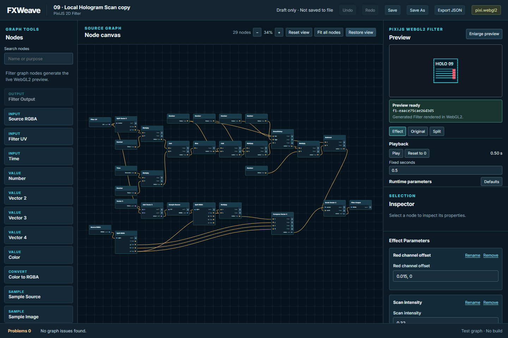
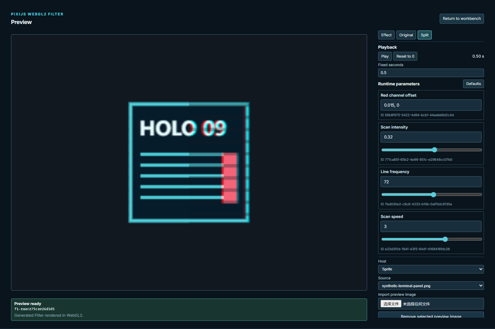

# V0 Phase 2 开发验证报告

日期：2026-10-01，Asia/Shanghai。状态：**READY_FOR_CHECK**；按 [8 轮指南](./29-v0-local-selfuse-goal-mode-execution-guide.md)完成本地实际素材技术试用及两处交互改进，等待规划会话独立验收。分支 `main`，远端 `origin/main`。最终交付为包含本报告的 `phase2 round8` 提交；精确提交 ID 由验收通知与 Git 历史提供。

## 八轮交付

| 轮 | 提交 | 结果 / 验证 |
| --- | --- | --- |
| 1 | `0bad251` | 私有忽略目录、来源基线、本地入口；实际导入 3 项、缺素材失败、typecheck |
| 2 | `1506d30` | 三件实际素材派生、调参、另存重开；修复 Sprite filterArea 重复缩放；72 单测、34 smoke、6 local、build |
| 3 | `1fa7d8c` | 同一画布大预览、返回与 Esc；72 单测、35 smoke、typecheck/build |
| 4 | `ee89e40` | 根据实际边界适配全图、F、Restore view；72 单测、38 smoke、typecheck/build |
| 5 | `337540a` | 实素材复走两项改进，保存重开视口/构建/像素一致；6 local、typecheck |
| 6 | `ed2c0f4` | 恢复索引、用户入口、保留人工记录；38 smoke、prepare 重跑与哈希不符负例、typecheck |
| 7 | `be0afcb` | 使用缓冲修复关闭 details 的焦点边界，补小窗口/旧画面回归；3 targeted、11 production、typecheck/build |
| 8 | 本报告所在提交 | 完整矩阵、公开合成截图、额外实素材参数复验、README/handoff、边界核查、推送并报告验收 |

每轮提交推送后才进入下一轮。第 7 轮缓冲仅用于焦点修复及回归。第 8 轮清理第 7 轮文档末尾多余空行；最终 `git diff --check` 通过。

## 三件可恢复本地工程

绝对目录：`D:\WebProjects\FXWeaver\.fxweave-local`。以下都是私有工程，已嵌入原图与项目依赖包、图默认参数、运行参数、固定时间、host 和适配视口。基于公开源图派生，图默认属性分别改为 Radius 0.4、Amplitude 0.06、Scan intensity 0.25；预览使用运行覆盖 0.3、0.1、0.4。没有手写效果补丁。

| 工程 | SHA-256 | 构建 ID | 固定时间 / host / 可见像素 |
| --- | --- | --- | --- |
| `work03.fxweave.json` | `0ae13f1bb73994b91b7b7d5ece7e9727d61852472cce378ebaa51266798eb0b5` | `f1-5f9ea9d2ed4943d9` | 0 / Sprite / 16312 |
| `work05.fxweave.json` | `9e0d7b0120bacebeb82b3bdfb8f71f7d84d9f2b2824397ca4c218d44fb296f94` | `f1-f8adda044117f170` | 0.75 / Container / 38488 |
| `work09.fxweave.json` | `fe3cced892ad9b0d0e7f40db60f520ef29f4797e04de5b3035264bc539f5b0ff` | `f1-eaace75cae26d3d5` | 0.5 / Sprite / 26059 |

Source 路径、尺寸、Alpha 与 SHA-256 见 [素材清单与观察](./30-phase2-local-trial.md)，私有 `source-baseline.json` 和 `asset-import-results.json` 可核对。构建不因素材、暴露参数默认/运行覆盖或 viewport 变化；图仍是语义源。最终每份 `workXX-result.json` 记录以上工程哈希及画面哈希：

- 03：`d031e8cca21476ae8a98197d8179c0754b00fc6733e41e0a00c678ad1363c0fd`
- 05：`7db1998a1deafe7bb9e0b9b6d0af36e85a1d7ae64d37d7ea6351442c527a2dab`
- 09：`4ac6a108bdd51ed234586f34c74ca566ea1bc724c17e65d81e17d7f4469ae12d`

画面哈希是 canvas PNG data URL 字符串的 SHA-256；工程哈希是文件字节 SHA-256。自动重跑会产生新项目身份与文件哈希，固定画面与构建可重现。正式 Save As 路径采用写入磁盘的浏览器文件句柄桥接，再 UI 重新打开物理文件，未把这称作人工 OS 文件选择操作。

私有 `workXX-before.png`、`-original.png`、`-effect.png`、`-workbench.png`、`-enlarged-effect.png`、`-enlarged-split.png` 关联参数/布局/对照。额外 `-probe-*` 截图验证 Center / Edge color、Frequency、Red channel offset。恢复索引 `CONTINUE.md` 和 `human-selfuse-record.md` 留在同一忽略目录。

## 实际观察与交互结论

- 03 横向图上的归一化 UV 圆呈椭圆，橙色锯齿烧蚀边界清楚；Center 改为 0.65,0.5 后窗口偏右，Edge color 改蓝后边缘变蓝，恢复参数回到原帧。此派生保留椭圆语义；未暗改 Distance 节点。
- 05 Container 中两张卡片明显横向波动，透明外轮廓仍透明；Frequency 26 改变波形，Amplitude 和时间同样响应。越界采样仍按生成 Shader 的透明边界规则，来源的部分 Alpha 被保留。
- 09 角色外部透明，蓝色扫描带、青/品红通道边缘可在大预览看清；红通道偏移归零减少偏移边缘，恢复后回到原帧，保持一个局部全息形态。
- 放大前人物在约 320px 宽的工作台预览中很小；放大后 stage 超过两倍宽，沿用同一个 canvas、构建、参数、时间及 Original/Split。Esc 和返回按钮可恢复焦点；600×800 控制可滚动访问。
- 长图原来受 50% 缩放下限影响；现在按钮/F 适配实际节点边界，三图包括根均保持至少 30px 余量。Restore view 可逆；保存重开恢复适配视口；输入框与大预览中的 F 不触发图适配。生成 GLSL 与构建保持不变。

公开示意仅使用合成示例：

## Debug / 架构与边界核查

两项实际缺陷均有最小回归：大透明 Sprite 的 local filterArea 换算；关闭 details 内按钮的焦点可见性。图、IR、生成器和 Pixi 运行适配器保持统一；大预览不建立第二套 Shader。viewport、UI 展开状态不参与编译；展开不写入图。

成功、无效图保留 Old preview、WebGL2 不可用、迟到资源加载、超大输入、错误导入、恢复取消、文件保存与草稿故障由公共 smoke 覆盖；缺实际素材由 local 明确失败。Unity 未启动，最终 Git 状态与基线相同（仅原先两份字体文件修改），三张原图哈希前后相同。

`git ls-files .fxweave-local` 为空，`git check-ignore` 确认私有工程被忽略。最终定向暂存检查仅代码、文本和两张合成图；原图片、带实际图片的工程和实际截图未加入 Git。不新增平台、效果类别、社区或 Unity 导出。

## 最终验证矩阵

| 命令 | 结果 |
| --- | --- |
| `npm run typecheck` | PASS |
| `npm test` | PASS，11 文件 / 72 项 |
| `npm run build` | PASS；主包 584.70 kB，现有 500 kB 提示仍在 |
| `npm run smoke` | PASS，40 项真实 Chrome/WebGL2 |
| `npm run smoke:preview` | PASS，11 项，使用生产 build |
| `npm run trial:local` | PASS，6 项，Unity 状态/源图哈希不变 |
| `npm run trial:prepare` | PASS，文件哈希校验、恢复索引及人工模板保留 |
| `npm run usability:capture` | PASS，1 项公开合成图采集 |
| `git diff --check` / 定向暂存 / 忽略核查 | PASS |

最终代理操作记录为 2026-10-01 03:25:40–03:25:45 Asia/Shanghai（JSON 使用 UTC），三件编辑动作各约 2.3–2.6 秒；不包含设计、开发、等待和目视检查耗时。自动流程是技术验证，人工操作者/日期/耗时及跨日事实在模板中仍空白。

## 用户入口与未验证门槛

按 [打开与继续创作](./32-phase2-user-trial.md)运行 dev 并打开私有工程。从已保存视口与固定参数继续，Save As 使用新文件名，避免自动试用覆盖；下一次使用从人工记录里的新文件继续。普通测试不依赖 Unity，本地验证可单独重跑。

人工真实使用与后一天持续编辑尚未发生，最终 V0 持续自用认证仍待验证。本报告只请求规划会话独立复验当前 Phase 2 技术交付；不自行宣布最终 V0 通过。
